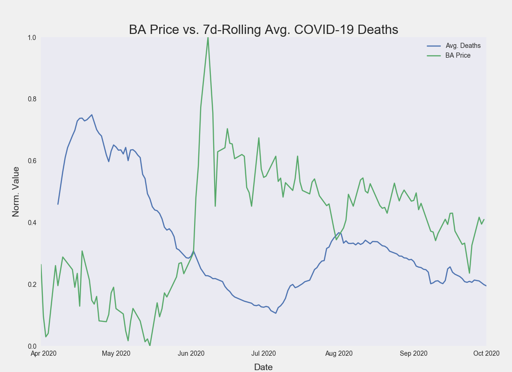

<h1 align="center">Ordinary Least Squares Regression: U.S COVID-19 Deaths, Cases, and US Equities</h1>

## Abstraction

The analysis looked to evaluate the variation in equity prices based on COVID-19 based predictors from April-September 2020. Data was gathered from online resources and then normalized, visualized, and analyzed with the Python programming language in a Jupyter Notebook.

During analysis, an ordinary least squares linear regression model explained 55.7% (Adj. R-squared) of the variation in the Boeing (BA) equity price using the 7-day rolling average for U.S COVID-19 deaths. This predictor was found to be statistically signficant with a p-value close to zero. 

## Introduction

Halfway through the year I wanted to relearn basic statistics and set a goal to perform an ANOVA on data (and write about it). Furthermore, I wanted to use Python to perform this analysis. 

There are a few reasons why I chose to examine the data that I did:
 - COVID-19 data is readily available
 - U.S equity prices are readily available
 - The COVID-19 pandemic has had a significant impact on many U.S equity prices
 
I hypothesized that I would find some sort of relationship between price and reported COVID-19 cases. The structure of an the analysis was relaxed, however, at the end I knew that I wanted to perform an ordinary least squares regression analysis and interpret the results. 

Initially, I thought that I could simply find a relationship between S&P500 daily returns and reported COVID-19 cases.

By the end, I was using the seven-day daily reported death rate to predict the variation in Boeing (BA) price, which is more reactive to the pandemic than the SPDR S&P 500 ETF Trust (SPY). 

## Methods

### Data Collection

**Historical stock data** was obtained from the Python library yfinance that offers:
"\[...\] a reliable, threaded, and Pythonic way to download historical market data from Yahoo! finance."

The historical stock data retreived was for The Boeing Company (BA) and the S&P 500 ETF Trust (SPY) for the dates March 31, 2020-October 1, 2020. The adjusted closing price was extracted and used to represent the price for each equity. 

The data was transformed into the following time series:
- daily price change (_daily_ret)
- normalized price using max-min (_max_min_norm_price)
- normalized daily price change using max-min (_max_min_norm_daily_ret)
- normalized price in relation to the price on 3/31/2020 (_start_val_norm_price)
- normalized daily return in relation to the return on 4/1/2020 (_start_val_norm_daily_ret)
- seven day rolling average for the max-min normalized daily returns (_7d_rolling_avg_max_min_daily_ret)
- seven day rolling average for the normalized price based on the price on 3/31/2020 (_7d_rolling_avg_start_val_norm_price)
- seven day rolling average for the normalized price based on the daily return on 4/1/2020 (_7d_rolling_avg_start_val_norm_ret)

**COVID-19 data** was obtained from the Covid Tracking Project (https://covidtracking.com/data). How does CTP source their data?

> Almost all of the data we compile is taken directly from the websites of local or state/territory public health authorities. Where data is missing from these websites, we supplement available numbers with information from official press conferences with governors or public health authorities.

The full dataset was download in CSV format. Only two columns were selcted, **death** and **positive**. This data was reported by date and by state. 

The totals were summed by date by adding up the values from each state.

The data was transformed into the following time series:
- daily change (daily_)
- normalized daily count using max-min (_max_min_norm_price)
- normalized daily count using count on 3/31/2020 (start_val_norm_daily_)
- seven day rolling average for the max-min normalized daily count (7d_rolling_avg_max_min_daily_)
- seven day rolling average for the normalized daily count based on the count from 4/1/2020 (7d_rolling_avg_start_val_daily_)

### Correlation and Ordinary Least Squares

The data was visualized using line-plots, scatter plot, and regression plots from the Python libraries Matplotlib and Seaborn. 

Simple correlation analysis was conducted with the Pandas Python library.

Ordinary least squares analysis was conducted using the ````ols```` method from the SciPy Python library. The function returns, among other indicators:
- regression coefficients
- tvalues
- pvalues
- r-squared
- adj. r-squared
- f-statistic
- 95% confidence interval for the intercept and coefficients


## Results

A correlation of **-0.749** was found between the normalized price of Boeing and the 7d rolling average for COVID-19 deaths. 



Performing an OLS analysis, with Boeing Price as the dependent variable, yielded the following results and summary table.


The p-value for the 7d avg. coefficient was 2.360545e-23.

## Conclusion

My hypothesis that I could find a relationship between COVID-19 pandemic statistics and U.S equity prices was confirmed. 

**55.7%** of variation in Boeing price (in this date frame) can be explained by the seven day rolling average for COVID-19 death rates in the U.S (independent variable). Furthermore, it is highly unlikely that we would observe this extreme of a correlation if the two series of data had no relationship. 
